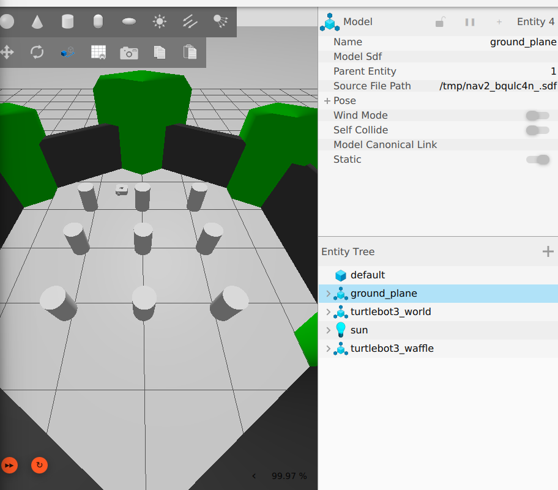

# Lab 2 Answers — TurtleBot Playground

## Driving observations

Describe what you observed during forward, reverse, curved, and in-place motion.

I observed that during forward motion, pressing "I" made the robot move directly forward and increased its linear x values with no rotating. Pressing "," made the robot move directly backwards and decreased/published negative x values, with no rotation. Pressing "u" and "o" caused angular, forward motion, where the x and z values changed simultaneously, and the robot followed a curved path. Pressing "j" or "l" caused only z values to change, and it made the robot rotate in place with no translational motion.

## Challenge screenshot

At bottom of the file or in the RESULTS folder in the repository.

# Lab 02 — TurtleBot Playground

## Captured Data

### 1. `/cmd_vel` Messages

**Forward Motion:**
```yaml
linear:
  x: 0.15
  y: 0.0
  z: 0.0
angular:
  x: 0.0
  y: 0.0
  z: 0.0
```

**Turning Motion:**
```yaml
linear:
  x: 0.0
  y: 0.0
  z: 0.0
angular:
  x: 0.0
  y: 0.0
  z: 0.8
```

---

### 2. `/odom` Message (After Motion)
```yaml
header:
  stamp:
    sec: 264
    nanosec: 204000000
  frame_id: odom
child_frame_id: base_footprint
pose:
  pose:
    position:
      x: 3.5824954143728505
      y: 1.7695799389119287
      z: 0.0
    orientation:
      x: 0.0
      y: 0.0
      z: -0.6828083104458863
      w: 0.7305975712976565
```
What changed was the x position and y position, as well as the time stamp. The orientation and twist velocity remained the same.

## Engineering questions

Answer Questions 1–4 from the README using observations from your own simulation session.

1. For forward motion, only the linear.x values changed (to 0.15 m/s). For turning, the linear.x values were zero and the angular.z values changed to 0.8 rad/s. When stopping, they both went to 0. They were both able to publish the same command as both the keyboard teleop node and the terminal commands create the same message type, and ROS-Gazebo bridge doesnt care about who sent it, it just listens to the commands and passes the instructions to the turtlebot.

2. The position values shifted, as x went from 3.5677 to 3.5825 and y went from 1.9881 to 1.7696. This is an estimate as odometry is being used to measure how much the wheels turn, but it can't account for the real-world errors like wheel slippage, uneven surfaces, friction, and bumping into things.

3. /cmd_vel only tells the robot how fast to move, not where to go, so without a system in place to keep track of the robot's position and steer it towards a final coordinate, it won't know where to go.

4. I observed by watching the gazebo screen and reading the /odom updates, basically doing what a LiDAR or camera would do but manually. I decided by looking at the cylinders and choosing how to steer around them, which is just manually doing what a path-planning software could do. I commanded by pressing keys to send movement messages, and autonomy replaces this with motion control algorithms that automatically adjust the wheel speeds for me. 


